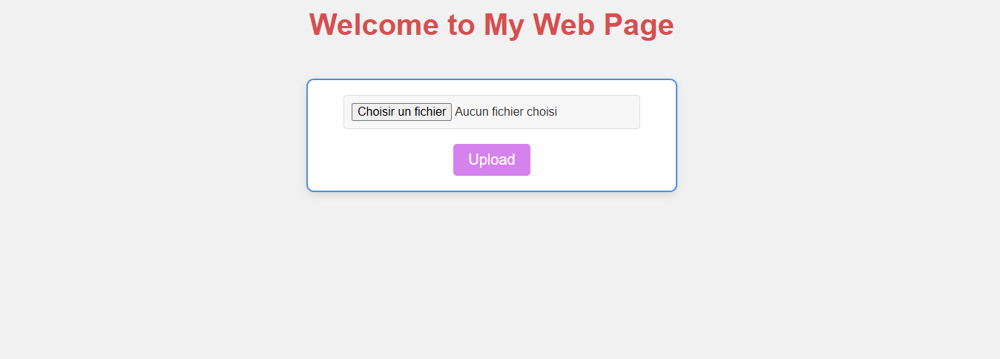
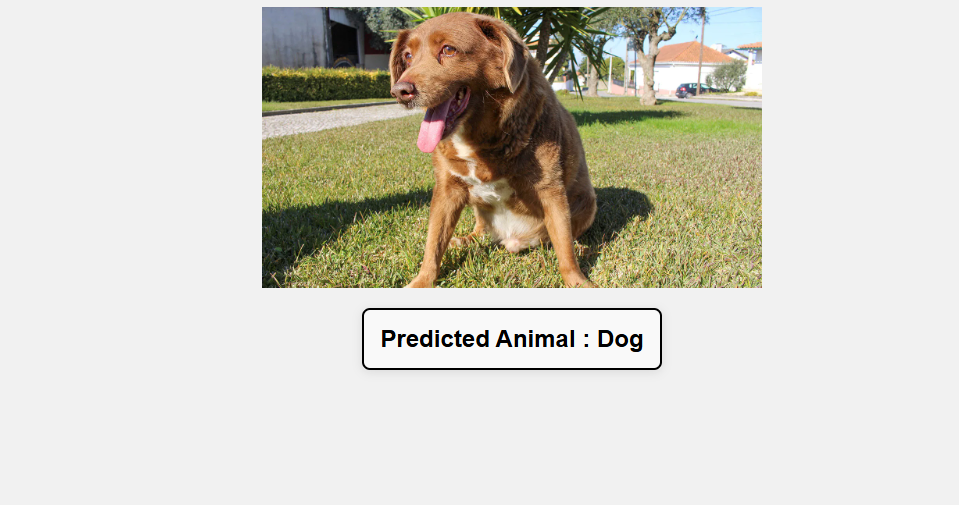

# Image Classification Project with Flask and TensorFlow

## Introduction

This project enables you to build and deploy an image classification model using a Convolutional Neural Network (CNN). It allows users to upload an image (such as a cat or dog) and predicts the label using a pre-trained model. The model is deployed through a Flask web application, making it easy for users to interact with and get real-time predictions.

## Objective

The goal of this project is to:
- Train a CNN model to classify images into two categories: "Cat" and "Dog".
- Deploy this model within a web application (built with Flask) to allow users to upload images and receive predictions.

## Features

- **Model Training**: The CNN model is trained to classify images into two categories: "Cat" and "Dog".
- **Model Saving and Loading**: The trained model can be saved and loaded for future use.
- **Web Interface**: A user-friendly web application where users can upload images and receive predictions.
  
  

- **Image Preprocessing**: Images are preprocessed before being fed into the model for predictions.
  
  

## Installation

### Prerequisites

- Python 3.x
- TensorFlow
- Flask
- NumPy
- Pillow (PIL)

### Installation Steps

1. **Clone the repository**:
   ```bash
   git clone https://github.com/hasnaoua/dogs_cats.git
   python -m venv venv
   source venv/bin/activate
   pip install -r requirements.txt

2. **Kaggle Dataset Download Tutorial**:
## Kaggle Dataset Download Tutorial

This project uses the Dog vs. Cat dataset from Kaggle. Below is a tutorial on how to create a Kaggle API key and download the dataset.

### Steps to Create a Kaggle API Key

21. **Sign Up / Log In to Kaggle**:  
   - Go to the [Kaggle website](https://www.kaggle.com/) and log in or sign up if you don’t already have an account.

22. **Create an API Token**:  
   - After logging in, click on your profile picture at the top-right corner of the Kaggle homepage and select **My Account**.  
   - Scroll down to the **API** section and click on the **Create New API Token** button.  
   - This will download a file named `kaggle.json` containing your API credentials.

23. **Place the API Key in the Correct Directory**:  
   - Move the `kaggle.json` file to the following directory:    
     - **macOS/Linux**: `~/.kaggle/kaggle.json`
     
24. **Install the Kaggle API Client**:  
   - Open your terminal and run the following command:  
     ```bash
     pip install kaggle
     ```

25. **Verify Installation**:  
   - To verify the Kaggle API is set up correctly, run:  
     ```bash
     kaggle datasets list
     ```
   - This should display a list of available datasets.

Once completed, you can use the Kaggle API client to download datasets directly from Kaggle.


### Model Architecture

### Summary Table

| Layer Type         | Output Shape       | Parameters |
|--------------------|--------------------|------------|
| Input Layer        | `(128, 128, 3)`   | 0          |
| Conv2D (32 filters)| `(128, 128, 32)`  | 896        |
| MaxPooling2D       | `(64, 64, 32)`    | 0          |
| Conv2D (64 filters)| `(64, 64, 64)`    | 18,496     |
| MaxPooling2D       | `(32, 32, 64)`    | 0          |
| Flatten            | `(65536)`         | 0          |
| Dense (128 units)  | `(128)`           | 8,388,608  |
| Dropout            | `(128)`           | 0          |
| Dense (1 unit)     | `(1)`             | 129        |

### Visual Representation

```plaintext
Input (128x128x3)
     ↓
Conv2D (32 filters, 3x3) + ReLU
     ↓
MaxPooling2D (2x2)
     ↓
Conv2D (64 filters, 3x3) + ReLU
     ↓
MaxPooling2D (2x2)
     ↓
Flatten
     ↓
Dense (128) + ReLU
     ↓
Dropout (0.5)
     ↓
Dense (1) + Sigmoid
